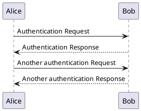

Git and GitHub are essential tools for modern software development. This comprehensive guide will help you master Git workflows and collaborate effectively with your team.



## Understanding Git Fundamentals

Git is a distributed version control system that tracks changes in your codebase. Every developer has a complete copy of the repository, enabling offline work and powerful collaboration.

### Basic Git Concepts

- **Repository**: A project folder tracked by Git
- **Commit**: A snapshot of your code at a specific point
- **Branch**: An independent line of development
- **Remote**: A version of your repository hosted elsewhere (like GitHub)

## Essential Git Commands

### Repository Setup

```bash
# Initialize a new repository
git init

# Clone an existing repository
git clone https://github.com/username/repo.git

# Check repository status
git status
```

### Making Changes

```bash
# Stage specific files
git add file1.js file2.js

# Stage all changes
git add .

# Commit with message
git commit -m "Add user authentication feature"

# Amend last commit
git commit --amend
```

### Viewing History

```bash
# View commit history
git log

# Compact log view
git log --oneline

# View changes in a commit
git show <commit-hash>

# View file history
git log --follow filename.js
```

## Branching Strategies

### Git Flow

Git Flow is a popular branching model for larger projects:

```bash
# Main branches
main      # Production-ready code
develop   # Integration branch for features

# Supporting branches
feature/* # New features
release/* # Release preparation
hotfix/*  # Production fixes
```

### Creating and Managing Branches

```bash
# Create a new branch
git branch feature/user-login

# Switch to branch
git checkout feature/user-login

# Create and switch in one command
git checkout -b feature/user-login

# List all branches
git branch -a

# Delete a branch
git branch -d feature/user-login

# Delete remote branch
git push origin --delete feature/user-login
```

## Working with Remote Repositories

### Syncing with Remote

```bash
# Add remote repository
git remote add origin https://github.com/username/repo.git

# View remotes
git remote -v

# Fetch changes from remote
git fetch origin

# Pull changes (fetch + merge)
git pull origin main

# Push changes to remote
git push origin feature/user-login

# Push and set upstream
git push -u origin feature/user-login
```

## GitHub Workflow

### Feature Development Workflow

**1. Create a Feature Branch**

```bash
# Always start from updated main
git checkout main
git pull origin main

# Create feature branch
git checkout -b feature/add-dark-mode
```

**2. Make Changes and Commit**

```bash
# Make your changes
# Stage and commit frequently
git add .
git commit -m "Add dark mode toggle component"

git add .
git commit -m "Implement dark mode styles"
```

**3. Push to GitHub**

```bash
# Push feature branch
git push -u origin feature/add-dark-mode
```

**4. Create Pull Request**

On GitHub:
- Navigate to your repository
- Click "Pull requests" → "New pull request"
- Select your feature branch
- Add description and reviewers
- Create pull request

**5. Code Review and Merge**

After approval:
```bash
# Update from main if needed
git checkout main
git pull origin main
git checkout feature/add-dark-mode
git merge main

# Resolve any conflicts
# Push updates
git push origin feature/add-dark-mode
```

## Handling Merge Conflicts

When conflicts occur:

```bash
# Pull latest changes
git pull origin main

# Git will mark conflicts in files
# Open conflicted files and look for:
<<<<<<< HEAD
Your changes
=======
Their changes
>>>>>>> branch-name

# Edit to resolve conflicts
# Remove conflict markers
# Keep the code you want

# Stage resolved files
git add resolved-file.js

# Complete the merge
git commit -m "Resolve merge conflicts"
```

## Advanced Git Techniques

### Interactive Rebase

Clean up commit history before merging:

```bash
# Rebase last 3 commits
git rebase -i HEAD~3

# In the editor, you can:
# pick = keep commit
# reword = change commit message
# squash = combine with previous commit
# drop = remove commit
```

### Cherry-Pick

Apply specific commits from one branch to another:

```bash
# Switch to target branch
git checkout main

# Cherry-pick a commit
git cherry-pick <commit-hash>
```

### Stashing Changes

Temporarily save uncommitted changes:

```bash
# Stash current changes
git stash

# List stashes
git stash list

# Apply most recent stash
git stash apply

# Apply and remove stash
git stash pop

# Stash with message
git stash save "Work in progress on feature X"
```

## GitHub Best Practices

### Pull Request Guidelines

**Good PR Description:**

```markdown
## Summary
Add user authentication with JWT tokens

## Changes
- Implement login/logout endpoints
- Add JWT middleware
- Create user session management
- Add authentication tests

## Testing
- [ ] All tests pass
- [ ] Tested login flow manually
- [ ] Checked token expiration

## Screenshots
[Add relevant screenshots]
```

### Commit Message Conventions

Use conventional commits:

```bash
# Format: <type>(<scope>): <subject>

git commit -m "feat(auth): add JWT authentication"
git commit -m "fix(api): handle null user response"
git commit -m "docs(readme): update installation steps"
git commit -m "refactor(utils): simplify date formatting"
git commit -m "test(auth): add login endpoint tests"
```

Types:
- `feat`: New feature
- `fix`: Bug fix
- `docs`: Documentation
- `style`: Formatting
- `refactor`: Code restructuring
- `test`: Tests
- `chore`: Maintenance

### Branch Naming Conventions

```bash
feature/user-authentication
bugfix/login-validation-error
hotfix/security-vulnerability
refactor/api-error-handling
docs/api-documentation
```

## Protecting Main Branch

Configure branch protection on GitHub:

1. Go to Settings → Branches
2. Add rule for `main` branch
3. Enable:
   - Require pull request reviews
   - Require status checks to pass
   - Require branches to be up to date
   - Include administrators

## Git Aliases for Productivity

Add to `~/.gitconfig`:

```ini
[alias]
    co = checkout
    br = branch
    ci = commit
    st = status
    unstage = reset HEAD --
    last = log -1 HEAD
    visual = log --graph --oneline --all
    amend = commit --amend --no-edit
```

Usage:
```bash
git co main
git br feature/new-feature
git st
```

## Handling Sensitive Data

### Never commit secrets!

```bash
# Create .gitignore
echo ".env" >> .gitignore
echo "config/secrets.yml" >> .gitignore
echo "node_modules/" >> .gitignore

# If accidentally committed
git rm --cached .env
git commit -m "Remove .env from tracking"

# For committed secrets, use
git filter-branch --force --index-filter \
  "git rm --cached --ignore-unmatch .env" \
  --prune-empty --tag-name-filter cat -- --all
```

## Collaboration Tips

1. **Pull before you push**: Always pull latest changes before pushing
2. **Commit often**: Make small, focused commits
3. **Write clear messages**: Help your future self and teammates
4. **Review carefully**: Take time to review PRs thoroughly
5. **Communicate**: Use PR comments and discussions effectively
6. **Keep branches short-lived**: Merge features quickly to avoid conflicts

## Conclusion

Mastering Git and GitHub workflows takes practice, but following these patterns will make you a more effective collaborator. Remember to:

- Use meaningful commit messages
- Create focused pull requests
- Review code thoroughly
- Keep your branches up to date
- Communicate with your team

With these skills, you'll contribute confidently to any project and collaborate seamlessly with developers worldwide.
