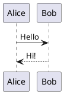
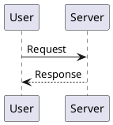

# RootCode - Project Documentation

> A modern, feature-rich Jekyll blog by **Rajesh Bhola** (@rajeshbhola)
> Live: [https://rajeshbhola.github.io/rootcode/](https://rajeshbhola.github.io/rootcode/)

---

## Table of Contents

1. [Project Overview](#1-project-overview)
2. [Tech Stack & Technologies](#2-tech-stack--technologies)
3. [Project Structure](#3-project-structure)
4. [Features & Functionalities](#4-features--functionalities)
5. [Theming & Design System](#5-theming--design-system)
6. [Pages & Layouts](#6-pages--layouts)
7. [Writing & Adding Posts](#7-writing--adding-posts)
8. [Configuration Guide](#8-configuration-guide)
9. [Local Development Setup](#9-local-development-setup)
10. [Deployment to GitHub Pages](#10-deployment-to-github-pages)
11. [Custom Domain Setup](#11-custom-domain-setup)
12. [SEO & Analytics](#12-seo--analytics)
13. [Third-Party Integrations](#13-third-party-integrations)
14. [JavaScript Features](#14-javascript-features)
15. [Customization Guide](#15-customization-guide)
16. [Troubleshooting](#16-troubleshooting)

---

## 1. Project Overview

RootCode is a personal blog built with **Jekyll** (a static site generator) and deployed on **GitHub Pages**. It features a modern UI with dark/light theme support, responsive design for all screen sizes, SEO optimization, and monetization support via Google AdSense.

### Key Highlights

- Dark/Light theme toggle with system preference detection
- Fully responsive (mobile, tablet, desktop)
- Client-side search
- Auto-generated Table of Contents for posts
- PlantUML diagram rendering
- YouTube video embedding
- Reading time estimation
- Related posts
- Category & tag taxonomy system
- Google AdSense integration
- Disqus comments
- Google Analytics
- RSS feed & sitemap auto-generation
- GitHub Actions CI/CD deployment

---

## 2. Tech Stack & Technologies

| Technology | Purpose |
|---|---|
| **Jekyll 3.9.0** | Static site generator (Ruby-based) |
| **GitHub Pages** | Hosting & deployment |
| **GitHub Actions** | CI/CD pipeline |
| **SCSS/Sass** | Stylesheet preprocessing |
| **CSS Custom Properties** | Theme variables (dark/light mode) |
| **Liquid** | Jekyll templating language |
| **Kramdown (GFM)** | Markdown parser (GitHub Flavored Markdown) |
| **Rouge** | Syntax highlighting |
| **JavaScript (ES6+)** | Interactive features (no framework) |
| **Google Fonts** | Typography (Inter, Fira Code, JetBrains Mono) |
| **Simple Jekyll Search** | Client-side search library |
| **PlantUML** | UML diagram rendering |
| **Pako** | Deflate compression for PlantUML |
| **Sharp** | Node.js image processing (favicon generation) |

### Plugins

| Plugin | Purpose |
|---|---|
| `jekyll-sitemap` | Auto-generates `sitemap.xml` |
| `jekyll-feed` | Auto-generates RSS feed (`feed.xml`) |
| `jekyll-seo-tag` | SEO meta tags (Open Graph, Twitter Cards) |
| `jekyll-paginate` | Pagination support |
| `kramdown-parser-gfm` | GitHub Flavored Markdown support |

---

## 3. Project Structure

```
rootcode/
├── _config.yml              # Main site configuration
├── _layouts/
│   ├── default.html         # Master layout (header, footer, nav, scripts)
│   ├── post.html            # Single post layout
│   └── page.html            # Static page layout
├── _includes/
│   ├── meta.html            # SEO meta tags
│   ├── adsense.html         # Google AdSense component
│   ├── analytics.html       # Google Analytics
│   ├── disqus.html          # Disqus comments
│   ├── reading-time.html    # Reading time calculation
│   └── svg-icons.html       # Social media icon links
├── _pages/
│   ├── about.md             # About page
│   ├── categories.html      # Categories listing
│   ├── tags.html            # Tags listing
│   └── search.md            # Search page
├── _posts/                  # Blog posts (Markdown files)
│   └── YYYY-MM-DD-title.md
├── _sass/
│   ├── _variables.scss      # CSS variables, mixins, breakpoints
│   ├── _highlights.scss     # Code syntax highlighting styles
│   ├── _reset.scss          # CSS reset
│   └── _svg-icons.scss      # Footer social icon styles
├── assets/
│   ├── style.scss           # Main stylesheet (~3350 lines)
│   ├── simple-jekyll-search.min.js  # Search library
│   └── js/
│       ├── theme-toggle.js       # Dark/light theme
│       ├── copy-code.js          # Copy button for code blocks
│       ├── scroll-to-top.js      # Scroll-to-top button
│       ├── reading-progress.js   # Reading progress bar
│       ├── table-of-contents.js  # Auto-generated TOC
│       ├── plantuml.js           # PlantUML diagram rendering
│       └── mobile-menu.js        # Mobile hamburger menu
├── images/
│   ├── logo.svg             # Site logo (RB)
│   └── favicon.svg          # Browser tab favicon (RB)
├── posts/
│   └── index.html           # All Posts page with pagination
├── index.html               # Homepage
├── 404.md                   # Custom 404 page
├── search.json              # Search index data
├── robots.txt               # SEO crawl rules
├── site.webmanifest         # PWA manifest
├── Gemfile                  # Ruby dependencies
├── package.json             # Node.js dependencies
├── generate_favicons.js     # Favicon generation script
└── .github/
    └── workflows/
        └── jekyll.yml       # GitHub Actions deployment workflow
```

---

## 4. Features & Functionalities

### Dark/Light Theme Toggle
- Toggle button in header (sun/moon icons)
- Persists user preference in `localStorage` (key: `rootcode-theme`)
- Respects system preference (`prefers-color-scheme`) on first visit
- Default: dark mode
- Smooth transition animation when switching
- Uses `[data-theme="dark"]` CSS attribute on `<html>` element

### Client-Side Search
- Instant search as you type
- Searches post titles and content
- Displays results with title, excerpt, date, and categories
- Powered by Simple Jekyll Search library
- Search data generated from `search.json`
- Limit: 10 results per query

### Reading Progress Bar
- Horizontal gradient bar at top of post pages
- Shows scroll progress through the article
- Throttled scroll listener for performance (10ms)
- Updates after images load

### Table of Contents (TOC)
- Auto-generated from `h2` and `h3` headings in posts
- Only appears if post has 3+ headings
- Collapsible sidebar (sticky on desktop)
- Active section highlighting via IntersectionObserver
- Smooth scroll navigation with 80px offset for header
- Nested structure (h3 items indented under h2)

### Copy Code Button
- Appears on all code blocks (`<pre>` elements)
- Uses Clipboard API with fallback
- Visual feedback: "Copy" → "Copied!" for 2 seconds
- Always visible on touch devices

### Scroll to Top
- Floating button appears when scrolled > 300px
- Smooth scroll animation to top
- Keyboard accessible (Enter/Space)
- Debounced scroll listener (100ms)

### PlantUML Diagrams
- Write PlantUML code in markdown code blocks with `plantuml` language
- Auto-rendered to SVG images via PlantUML server
- Loading spinner while rendering
- Fullscreen modal viewer
- Download SVG button
- Uses Pako library for compression

### YouTube Video Embedding
- Add `youtube_video_id` to post front matter
- Auto-renders responsive video player
- Optional description via `youtube_description`
- Lazy loading for performance

### Related Posts
- Shows up to 6 related posts at bottom of each post
- Related by shared categories
- Sorted by date (newest first)
- Card layout with title, date, and excerpt

### Category Modal (Post Footer)
- Click category badge on a post to see all posts in that category
- Modal popup with post cards
- Close via X button, overlay click, or ESC key

### Pagination (All Posts Page)
- Client-side pagination (10 posts per page)
- Previous/Next buttons
- Page number navigation with ellipsis
- Smooth scroll to top on page change
- Shows "Page X of Y" info

### Mobile Hamburger Menu
- Slide-in navigation drawer on mobile (< 640px)
- Overlay backdrop
- Closes on link click, ESC key, or resize to desktop
- Body scroll lock when open
- Accessible: `aria-expanded` attribute

---

## 5. Theming & Design System

### Color Palette

| Token | Light Mode | Dark Mode |
|---|---|---|
| `--bg-primary` | `#ffffff` | `#1a1a1a` |
| `--bg-secondary` | `#f8f9fa` | `#242424` |
| `--text-primary` | `#222222` | `#e8e8e8` |
| `--text-secondary` | `#555555` | `#b0b0b0` |
| `--text-tertiary` | `#888888` | `#808080` |
| `--border-primary` | `#e9ecef` | `#363636` |
| `--code-bg` | `#f6f8fa` | `#2d2d2d` |
| `--code-color` | `#d63384` | `#ff7b72` |

### Brand Gradient
```css
linear-gradient(135deg, #667eea 0%, #764ba2 100%)
```
Used in: header, footer, buttons, post hero, badges, category cards.

### Typography

| Element | Font | Size (Desktop) | Size (Mobile) |
|---|---|---|---|
| Body | Inter | 16px | 15px |
| H1 | Inter | 32px | 26px |
| H2 | Inter | 26px | 22px |
| H3 | Inter | 22px | 17px |
| H4 | Inter | 18px | 15px |
| Code | Fira Code / JetBrains Mono | 15px | 13px |
| Post Content | Inter | 17px | 15px |

### Breakpoints

| Name | Range | Mixin |
|---|---|---|
| Mobile | 0 – 640px | `@include mobile { }` |
| Tablet | 641px – 980px | `@include tablet { }` |
| Desktop | 981px+ | Default styles |

### Spacing Convention
- Container max-width: `940px`
- Container padding: `24px` (desktop), `20px` (mobile)
- Card border-radius: `16px` (desktop), `12px` (mobile)
- Mobile side margin: `0.6em` for content sections

---

## 6. Pages & Layouts

### Homepage (`index.html`)
- **Hero section**: Welcome message, author name, description
- **Stats**: Article count, total reading time, topic count
- **Latest Articles**: Grid of 6 most recent posts
- **AdSense**: Header, between-posts, footer placements

### All Posts (`posts/index.html`)
- **Header**: "All Posts" with gradient background
- **Posts Grid**: All posts displayed in card format
- **Pagination**: Client-side, 10 posts per page
- Shows all posts (not limited like homepage)

### Single Post (`_layouts/post.html`)
- **Reading progress bar** at top
- **Post hero**: Title, categories, tags, author info, date, reading time
- **AdSense**: In-article ad
- **Content area**: Full post with responsive images, code blocks, etc.
- **YouTube video** (optional)
- **Footer taxonomy**: Categories and tags with modal
- **Related posts** section
- **Disqus comments**

### Categories (`_pages/categories.html`)
- **Header**: "Browse by Category" with gradient
- **Grid**: Category cards with post count and descriptions
- **Modal**: Click a category to see all its posts

### Tags (`_pages/tags.html`)
- **Header**: "Browse by Tags"
- **Tag Cloud**: All tags displayed as badges
- **Post List**: Click a tag to see its posts

### About (`_pages/about.md`)
- **Hero**: Avatar, name, tagline, social links
- **Intro**: About the blog
- **Feature Cards**: Technical Tutorials, Best Practices, etc.
- **Author Section**: Bio and skills
- **CTA**: Subscribe and star buttons

### Search (`_pages/search.md`)
- **Search Input**: Real-time search
- **Results**: Title, excerpt, date, categories

### 404 Page (`404.md`)
- Custom error page with link back to homepage

---

## 7. Writing & Adding Posts

### Step 1: Create a New Post File

Create a new Markdown file in the `_posts/` directory:

```
_posts/YYYY-MM-DD-your-post-title.md
```

Example:
```
_posts/2025-03-10-getting-started-with-docker.md
```

### Step 2: Add Front Matter

Every post must start with YAML front matter:

```yaml
---
layout: post
title: "Getting Started with Docker"
categories: [DevOps, Docker]
tags: [docker, containers, devops, tutorial]
excerpt: "Learn the basics of Docker containerization..."
---
```

### Available Front Matter Fields

| Field | Required | Description |
|---|---|---|
| `layout` | Yes | Always `post` |
| `title` | Yes | Post title |
| `categories` | Recommended | Array of categories (e.g., `[Web Dev, React]`) |
| `tags` | Recommended | Array of tags (e.g., `[react, javascript]`) |
| `excerpt` | Optional | Custom excerpt (auto-generated if not set) |
| `youtube_video_id` | Optional | YouTube video ID to embed |
| `youtube_description` | Optional | Description below the video |
| `image` | Optional | Custom image for social sharing |
| `last_modified_at` | Optional | Last updated date (e.g., `2025-03-10`) |

### Step 3: Write Content

Use GitHub Flavored Markdown:

```markdown
## Introduction

This is a paragraph with **bold** and *italic* text.

### Code Example

```python
def hello():
    print("Hello, World!")
```

### Lists

- Item one
- Item two
- Item three

### Images


### Links

[Link text](https://example.com)

### PlantUML Diagrams


```

### Step 4: Preview Locally

```bash
bundle exec jekyll serve
```

Open `http://localhost:4000/rootcode/` in your browser.

### Step 5: Publish

```bash
git add _posts/2025-03-10-getting-started-with-docker.md
git commit -m "Add post: Getting Started with Docker"
git push origin main
```

GitHub Actions will automatically build and deploy.

### Post Tips

- **File naming**: Date must be in `YYYY-MM-DD` format
- **Categories**: Use 1-3 categories per post
- **Tags**: Use 3-6 descriptive tags
- **Excerpts**: First paragraph is auto-used if not specified
- **Images**: Place in `images/` folder, reference with `{{ site.baseurl }}/images/...`
- **Code blocks**: Use triple backticks with language name for syntax highlighting
- **Drafts**: Put unfinished posts in `_drafts/` folder (won't be published)

---

## 8. Configuration Guide

### `_config.yml` — Key Settings

#### Site Identity
```yaml
name: "@rajeshbhola"            # Displayed in header
description: "Thoughts & ideas"  # Displayed below name
author: "Rajesh Bhola"          # Author name on posts
avatar: /rootcode/images/logo.svg  # Header logo
author_image: https://...       # Author photo URL
```

#### URLs
```yaml
url: https://rajeshbhola.github.io  # Your GitHub Pages URL
baseurl: /rootcode                    # Repository name (subpath)
permalink: /:title/                   # Post URL format
```

#### Social Links (Footer Icons)
```yaml
footer-links:
  github: rajeshbhola
  youtube: "@bholarajesh"
  linkedin: rajeshbhola1
  twitter: your-twitter
  email: your-email@example.com
  instagram: your-instagram
  rss: true
```

#### Plugins
```yaml
plugins:
  - jekyll-sitemap
  - jekyll-feed
  - jekyll-seo-tag
  - jekyll-paginate
```

#### Google AdSense
```yaml
google_adsense_enabled: true
google_adsense_id: "ca-pub-XXXXXXXXXX"
adsense_slots:
  header: "SLOT_ID"
  sidebar: "SLOT_ID"
  in-article: "SLOT_ID"
  footer: "SLOT_ID"
  between-posts: "SLOT_ID"
```

#### Google Analytics
```yaml
google_analytics: UA-XXXXX-X
```

#### Disqus Comments
```yaml
disqus: your-disqus-shortname
```

---

## 9. Local Development Setup

### Prerequisites

- **Ruby** (>= 2.7) — [Install Ruby](https://www.ruby-lang.org/en/downloads/)
- **Bundler** — `gem install bundler`
- **Node.js** (optional, for favicon generation) — [Install Node.js](https://nodejs.org/)
- **Git** — [Install Git](https://git-scm.com/)

### Installation Steps

```bash
# 1. Clone the repository
git clone https://github.com/rajeshbhola/rootcode.git
cd rootcode

# 2. Install Ruby dependencies
bundle install

# 3. (Optional) Install Node.js dependencies
npm install

# 4. Start the development server
bundle exec jekyll serve

# 5. Open in browser
# http://localhost:4000/rootcode/
```

### Useful Commands

| Command | Description |
|---|---|
| `bundle exec jekyll serve` | Start dev server with live reload |
| `bundle exec jekyll serve --drafts` | Include draft posts |
| `bundle exec jekyll build` | Build site to `_site/` |
| `npm run serve` | Shortcut for jekyll serve |
| `npm run build` | Shortcut for jekyll build |
| `npm run generate:favicons` | Regenerate favicon PNGs from SVG |

### Live Reload

Jekyll watches for file changes automatically. Save a file and refresh the browser to see changes. For SCSS changes, Jekyll recompiles automatically.

> **Note:** Changes to `_config.yml` require restarting the server.

---

## 10. Deployment to GitHub Pages

### Automatic Deployment (GitHub Actions)

The project uses GitHub Actions for automated deployment. Every push to `main` triggers a build and deploy.

**Workflow file:** `.github/workflows/jekyll.yml`

**How it works:**
1. Push code to `main` branch
2. GitHub Actions triggers the workflow
3. **Build job**: Checks out code → Installs Ruby → Builds Jekyll site
4. **Deploy job**: Uploads built site to GitHub Pages

### Manual Deployment Steps

```bash
# 1. Make your changes
# 2. Commit and push
git add .
git commit -m "Your commit message"
git push origin main

# 3. GitHub Actions automatically builds and deploys
# Check progress: GitHub repo → Actions tab
```

### First-Time GitHub Pages Setup

1. Go to your GitHub repository
2. Navigate to **Settings** → **Pages**
3. Under **Source**, select **GitHub Actions**
4. Push to `main` — the workflow will run automatically
5. Your site will be live at: `https://yourusername.github.io/rootcode/`

### Environment Variables

The GitHub Actions workflow sets:
- `JEKYLL_ENV: production` — Enables production-only features
- `baseurl` — Auto-detected from GitHub Pages settings

---

## 11. Custom Domain Setup

### Step 1: Buy a Domain

Purchase a domain from a registrar (e.g., Namecheap, GoDaddy, Google Domains, Cloudflare).

### Step 2: Configure DNS Records

At your domain registrar, add these DNS records:

**For apex domain (example.com):**
```
Type: A
Name: @
Values:
  185.199.108.153
  185.199.109.153
  185.199.110.153
  185.199.111.153
```

**For www subdomain:**
```
Type: CNAME
Name: www
Value: yourusername.github.io
```

### Step 3: Configure GitHub Pages

1. Go to **Settings** → **Pages**
2. Under **Custom domain**, enter your domain (e.g., `example.com`)
3. Check **Enforce HTTPS**
4. GitHub will create a `CNAME` file in your repository

### Step 4: Update `_config.yml`

```yaml
url: https://example.com    # Your custom domain
baseurl: ""                  # Empty for custom domain (no subpath)
enforce_ssl: https://example.com
```

### Step 5: Wait for DNS Propagation

DNS changes can take up to 48 hours. Check status at **Settings** → **Pages**.

---

## 12. SEO & Analytics

### Built-in SEO Features

- **jekyll-seo-tag**: Auto-generates Open Graph, Twitter Cards, and meta tags
- **Sitemap**: Auto-generated at `/sitemap.xml`
- **RSS Feed**: Auto-generated at `/feed.xml`
- **robots.txt**: Configured to allow all crawlers
- **Structured Data**: JSON-LD schema for BlogPosting and WebSite
- **Canonical URLs**: Automatically set
- **Meta description**: From post excerpt or site description

### Meta Tags (from `_includes/meta.html`)

```html
<!-- Auto-generated for each page -->
<meta name="robots" content="index, follow, max-image-preview:large">
<meta property="og:image" content="...">
<meta property="article:published_time" content="...">
<meta name="twitter:image" content="...">
```

### Google Analytics Setup

1. Create a Google Analytics property
2. Get your tracking ID (UA-XXXXX-X or G-XXXXXXXXXX)
3. Add to `_config.yml`:
   ```yaml
   google_analytics: UA-XXXXX-X
   ```

### Google Search Console

1. Go to [Google Search Console](https://search.google.com/search-console)
2. Add your site URL
3. Verify ownership (HTML tag or DNS)
4. Submit your sitemap: `https://yoursite.com/rootcode/sitemap.xml`

---

## 13. Third-Party Integrations

### Google AdSense

**Setup:**
1. Apply for Google AdSense at [adsense.google.com](https://adsense.google.com)
2. Get your publisher ID and ad slot IDs
3. Add to `_config.yml`:
   ```yaml
   google_adsense_enabled: true
   google_adsense_id: "ca-pub-XXXXXXXXXX"
   adsense_slots:
     header: "1234567890"
     in-article: "1234567891"
     footer: "1234567892"
     between-posts: "1234567893"
   ```

**Ad Placements:**
| Location | Slot Name | Page |
|---|---|---|
| Top of homepage | `header` | index.html |
| Inside post content | `in-article` | post.html |
| Bottom of homepage | `footer` | index.html |
| Between post cards | `between-posts` | index.html |

### Disqus Comments

**Setup:**
1. Create account at [disqus.com](https://disqus.com)
2. Register your site
3. Get your shortname
4. Add to `_config.yml`:
   ```yaml
   disqus: your-shortname
   ```

Comments appear at the bottom of every post automatically.

### PlantUML Diagrams

No setup needed. Just use PlantUML code blocks in your posts:

````markdown

````

Diagrams are rendered via the public PlantUML server.

---

## 14. JavaScript Features

All scripts are in `assets/js/` and loaded with `defer` attribute for performance.

| Script | Size | Purpose |
|---|---|---|
| `theme-toggle.js` | 87 lines | Dark/light theme management |
| `copy-code.js` | 115 lines | Copy button on code blocks |
| `scroll-to-top.js` | 81 lines | Floating scroll-to-top button |
| `reading-progress.js` | 77 lines | Post reading progress bar |
| `table-of-contents.js` | 224 lines | Auto-generated TOC sidebar |
| `plantuml.js` | 208 lines | PlantUML diagram rendering |
| `mobile-menu.js` | 74 lines | Mobile navigation menu |

### Loading Strategy

1. **theme-toggle.js** — Loaded immediately (inline + script) to prevent flash of wrong theme
2. **All other scripts** — Loaded with `defer` attribute (non-blocking)
3. **Pako library** — Loaded async from CDN (only needed for PlantUML)

---

## 15. Customization Guide

### Change Site Name & Description

Edit `_config.yml`:
```yaml
name: "Your Name"
description: "Your tagline"
author: "Your Full Name"
```

### Change Logo

Replace `images/logo.svg` and `images/favicon.svg` with your own SVG files.

### Change Colors

Edit `_sass/_variables.scss`:

```scss
// Change the brand gradient
:root {
  --gradient-primary: linear-gradient(135deg, #your-color1 0%, #your-color2 100%);
}
```

Search for `#667eea` and `#764ba2` in `assets/style.scss` to update the gradient throughout.

### Add a New Page

1. Create a file in `_pages/`:
   ```yaml
   ---
   layout: page
   title: "My New Page"
   permalink: /my-page/
   ---

   Your content here...
   ```

2. Add navigation link in `_layouts/default.html`:
   ```html
   <a href="{{ site.baseurl }}/my-page/" class="nav-link">My Page</a>
   ```

### Add Social Links

Edit `_config.yml` under `footer-links`:
```yaml
footer-links:
  github: your-username
  twitter: your-handle
  linkedin: your-profile
```

Icons automatically appear in the footer.

### Modify Homepage Hero

Edit `index.html` — the hero section is at the top:
```html
<div class="home-hero">
  <div class="hero-content">
    <h1 class="hero-title">Your Title</h1>
    <p class="hero-description">Your description</p>
  </div>
</div>
```

---

## 16. Troubleshooting

### Common Issues

**Site not updating after push:**
- Check GitHub Actions tab for build errors
- Clear browser cache (Ctrl+Shift+R)
- Wait 1-2 minutes for deployment

**`_config.yml` changes not reflecting:**
- Restart the Jekyll server (`Ctrl+C` then `bundle exec jekyll serve`)
- Config changes require a server restart

**Broken styles locally:**
- Run `bundle exec jekyll build` first
- Check for SCSS syntax errors in terminal output

**Posts not showing:**
- Ensure filename format: `YYYY-MM-DD-title.md`
- Ensure date is not in the future
- Ensure `layout: post` is in front matter

**Search not working:**
- Check that `search.json` exists and is valid JSON
- Rebuild site after adding new posts

**Dark mode flashing white:**
- Ensure `theme-toggle.js` is loaded before other scripts
- Check `localStorage` for `rootcode-theme` key

**Images not loading:**
- Use `{{ site.baseurl }}/images/your-image.png` for paths
- Ensure images are in the `images/` directory

**PlantUML diagrams not rendering:**
- Check browser console for errors
- Ensure Pako library is loaded
- PlantUML server may be temporarily down

### Getting Help

- **Jekyll Docs**: [jekyllrb.com/docs](https://jekyllrb.com/docs/)
- **GitHub Pages Docs**: [docs.github.com/en/pages](https://docs.github.com/en/pages)
- **Liquid Templating**: [shopify.github.io/liquid](https://shopify.github.io/liquid/)

---

*Last updated: March 2026*
